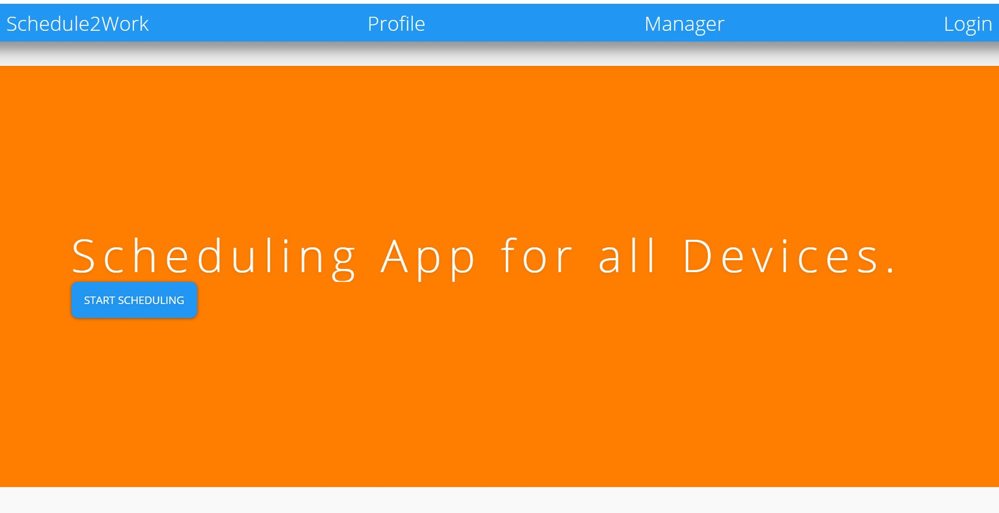

# Schedule2Work

Schedule2Work (ver.1.0.0) is an app designed to assist small businesses with storing employee information & scheduling shifts, with an emphasis on features desirable for local fast-food restaurants with part-time employees.  The client-facing website was created with React.js, and relies on data stored on a separate server created with Node.js.   

## Getting Started

Schedule2Work is deployed via Heroku.  A direct link for the Heroku deployed app can be found here: https://jl2cschedule2work.herokuapp.com/

Files and other information can be found on GitHub here: 

Client-side: https://github.com/JoeLearns2Code/Schedule2Work  
Server-side: https://github.com/ckaoki/Schedule2Work-backend  

If you wish to deploy locally, please see the Prerequisites and Installing sections below.  Otherwise, you can access the program from the Heroku link.

## Instructions

Once you are on the main page, you can access various pages by clicking on the corresponding links on the navbar.  

### Login:

This page is currently used for authentication.  To test the feature, enter the email as "a@1.com" and the password as "password".

### Profile:

This page is where an employee can view their basic information.  Simply enter in a number starting with 1, and click on the search button.  This should bring up the first employee's information.  Change the number searched to view other employee data.

### Manager:

The purpose of this page is to allow management staff access to the complete employee roster, add new employees, and create new shifts.  Several features are currently under development.

Calendar - This feature is currently under development.  It relies on the data.fns package to populate the calendar with current date information.  Future iterations will allow some general shift information to be displayed here.

Enter New Employee Information - Allows the user to add new employees, esentially making a POST to the api/employees table.

Enter New Shift Information - Allows the user to add new shifts, essentialy making a POST tothe api/shifts table.

Shift Display - Currently under development.  Displays the shifts for the current 2-week period. Clicking on one of the days will show more shift details in the adjacent menu. 

Employee Information - Allows the user to view all employee data.  Click on "Get Employees" to bring up this information.  Click on "Clear Employees" to collapse this data.

## Prerequisites

The data can be pulled directly from GitHub via GitBash on PC or via Terminal on Mac.  If you are new to this process, please follow the directions below:

When you have accessed the repository page on GitHub, you may simply download a Zip file and extract it to a directory of your choosing.  Alternatively, you may download the data directly to your device via GitBash if you have an SSH key.  More on adding an SSH key can be found here: https://help.github.com/en/enterprise/2.15/user/articles/adding-a-new-ssh-key-to-your-github-account

## Installing

Once you have the repository cloned, you will also need to have the basic npm package library installed.  Simply type "npm install" in the console when you are within the main folder.  In order for the client-side/front-end to function locally, you will also need to install the following npm packages:

npm i react-router-dom
npm i date-fns
npm i react-bootstrap
npm i mdbreact
npm i reactstrap

## Testing

If you are using Chrome as your browser, React elements(props, states, etc.) can be viewed by installing the following extension: https://chrome.google.com/webstore/detail/react-developer-tools/fmkadmapgofadopljbjfkapdkoienihi?hl=en

Test API connections with Postman: https://www.getpostman.com/

## Deployment

Navigate to https://github.com/ to clone.  Carefully follow the installation instructions above to deploy locally.

## Built With

Visual Studio Code: https://code.visualstudio.com/  
React.js: https://reactjs.org/  
Node.js: https://nodejs.org/en/  
Heroku: https://dashboard.heroku.com  

## Contributing

Feel free to fork either repository for your own study.  

## Versioning

Use github for version control (https://github.com/your/project/tags).

## In development

Future development is needed to get the primary features of the Manager page fully functional.  This includes populating the calendar component with current schedule data, displaying complete & correct Shift Detail information, and adding the abilty to update specific employee & shift records.

## Authors

* **Maryanne Heinbaugh** - Project Manager, JavaScript(server-side), Testing(API, Database Tables, Seeding)  
* **Cullen Aoki** - JavaScript(server-side), API(server-side), GitMaster(server-side)  
* **Iman Gure** - React.js,ApI & CSS (Client-side) 
* **Joe Hutchinson** - React.js, API(client-side), GitMaster(client-side)  

## License

This project is not licensed.

## Acknowledgments

* Joe Rehfuss
* Trae Shanks
* Abdul Aziz
* Gabe

Thank you to our instructor & TA's for all of their support.
